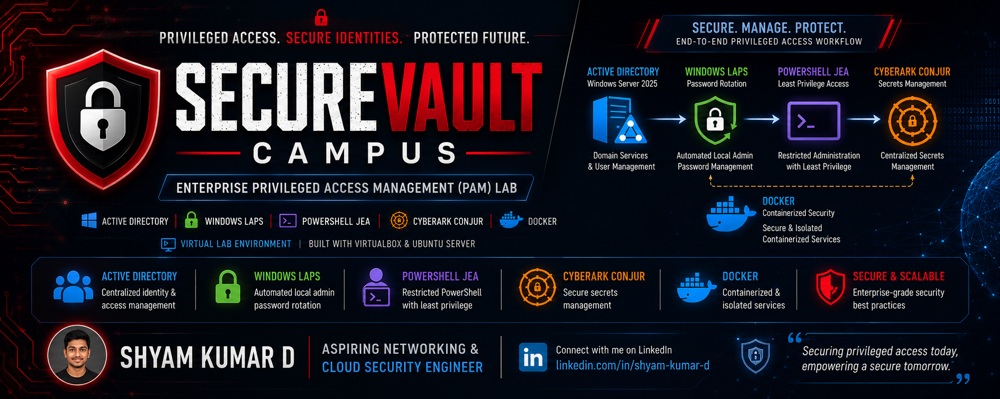

<p align="center">
  
</p>

# SecureVault Campus# 🔐 SecureVault Campus


> A Simulated Privileged Access Management (PAM) Lab using CyberArk Conjur Open Source, Windows Server Active Directory, Windows LAPS and PowerShell JEA.


---
# 🏗️ Architecture Diagram


# 📖 Overview

SecureVault Campus is a self-built Privileged Access Management (PAM) lab designed to demonstrate the core concepts behind CyberArk PAM using freely available technologies.

The project simulates enterprise privileged access management by combining:

- Windows Server 2025 Active Directory
- Windows LAPS
- PowerShell JEA
- CyberArk Conjur Open Source
- Docker
- Oracle VirtualBox

---

# 🏗 Architecture

DC01
- Active Directory
- DNS
- Group Policy

↓

CLIENT01

- Domain Joined Server
- Windows LAPS
- JEA Restricted Endpoint

↓

CONJURVM

- Ubuntu Server
- Docker
- CyberArk Conjur Open Source

---

# 🚀 Features

✅ Active Directory Domain

✅ Organizational Units

✅ Domain Users

✅ Domain Joined Server

✅ Windows LAPS

✅ Password Rotation

✅ Just Enough Administration (JEA)

✅ CyberArk Conjur Open Source

✅ Secret Management

✅ Docker Deployment

✅ PowerShell Automation

---

# 🛠 Technologies

- Windows Server 2025
- Ubuntu Server 24.04
- Active Directory
- Group Policy
- Windows LAPS
- PowerShell
- Docker
- Docker Compose
- CyberArk Conjur OSS
- Oracle VirtualBox

---

# 📂 Project Structure

```text
SecureVault-Campus
│
├── docs
├── docker
├── diagrams
├── screenshots
├── scripts
└── README.md
```

---

## 📸 Project Screenshots

### Active Directory Structure


### Domain Joined Client Verification


### Windows LAPS Password Retrieval


### LAPS Password Report


### PowerShell JEA Restricted Session


### Available Commands in JEA


### LAPS Group Policy


### CyberArk Conjur Docker Services


### Conjur Policy & Secret Retrieval


### Conjur Secret Management


# 🎯 Learning Outcomes

This project demonstrates practical knowledge of:

- Identity Management
- Privileged Access Management
- Least Privilege
- Secret Management
- Windows Administration
- Linux Administration
- Docker
- PowerShell Automation

---
# 📖 Project Overview

SecureVault Campus is a simulated enterprise Privileged Access Management (PAM) lab that demonstrates how organizations secure privileged accounts using Microsoft Active Directory, Windows LAPS, PowerShell Just Enough Administration (JEA), and CyberArk Conjur Open Source.

The project simulates a production-style environment using three virtual machines connected through a secure virtual network. It showcases password rotation, least-privilege administration, secret management, and secure authentication workflows.
# ✨ Key Features

- Active Directory Domain Services (AD DS)
- Organizational Unit (OU) Management
- Domain User Management
- Windows LAPS Password Rotation
- PowerShell JEA Restricted Administration
- CyberArk Conjur Open Source
- Docker-based Secret Management
- Secure Secret Retrieval
- Least Privilege Administration
- Role-Based Access Control (RBAC)
# 🛠 Technologies Used

- Windows Server 2025
- Ubuntu Server 24.04 LTS
- Active Directory Domain Services
- Windows LAPS
- PowerShell
- Docker Engine
- Docker Compose
- CyberArk Conjur Open Source
- Oracle VirtualBox

# 👨‍💻 Author

**Shyam Kumar D**

LinkedIn

https://linkedin.com/in/shyam-kumar-d

GitHub

https://github.com/ShyamD2

---

⭐ If you like this project, consider giving it a Star!