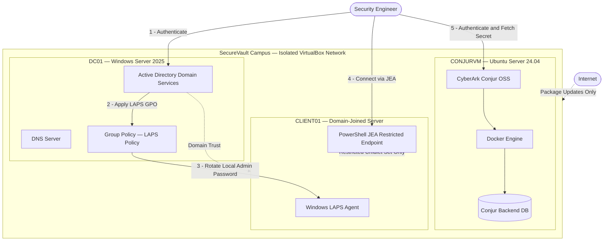
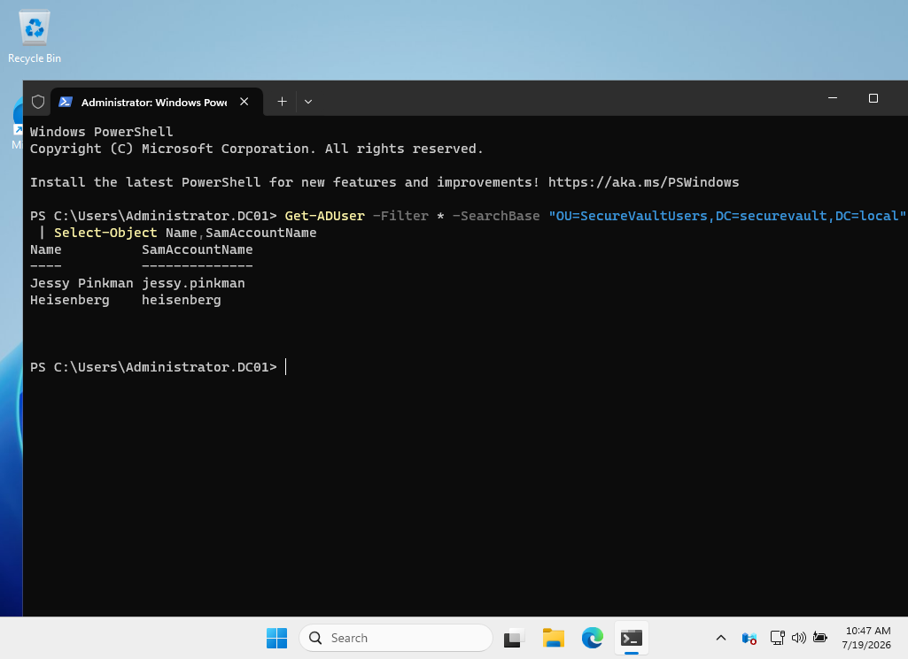

<div align="center">


# 🔐 SecureVault Campus

### Simulated Privileged Access Management (PAM) Lab
**CyberArk Conjur Open Source · Windows Active Directory · Microsoft LAPS · PowerShell JEA**

<p>
A self-built enterprise-style lab recreating the core pillars of CyberArk PAM —<br/>
Identity Management · Password Rotation · Least Privilege · Secrets Management
</p>

<p>
  
  
  
  
  
  
  
  
</p>

<p>
  
  
  
  
</p>

**[📖 Documentation](docs/) · [🏗 Architecture](ARCHITECTURE.md) · [⚙️ Installation](INSTALLATION.md) · [📸 Screenshots](#-screenshots)**

</div>

---

## 📑 Table of Contents

- [Overview](#-overview)
- [Why This Project Matters](#-why-this-project-matters)
- [Architecture](#-architecture)
- [Features](#-features)
- [Tech Stack](#-tech-stack)
- [Repository Structure](#-repository-structure)
- [Project Workflow](#-project-workflow)
- [Screenshots](#-screenshots)
- [Technical Deep Dive](#-technical-deep-dive)
- [Skills Demonstrated](#-skills-demonstrated)
- [Lessons Learned & Roadmap](#-lessons-learned--roadmap)
- [Documentation](#-documentation)
- [Author](#-author)

---

## 📖 Overview

**SecureVault Campus** is a hands-on Privileged Access Management lab built from the ground up to demonstrate the concepts that sit at the core of **CyberArk's PAM suite** — using free, industry-standard tooling instead of a commercial license.

The lab provisions a small three-tier "campus" domain and layers four PAM disciplines on top of it:

| Discipline | Technology | CyberArk Equivalent |
|---|---|---|
| Identity foundation | Active Directory Domain Services + OUs | Core PAS identity store |
| Local admin password rotation | Windows LAPS | CPM (Central Policy Manager) |
| Least-privilege administration | PowerShell JEA | PSM / restricted sessions |
| Secrets management & retrieval | CyberArk Conjur OSS on Docker | Conjur Enterprise / AAM |

Every component was deployed, configured, and verified inside an isolated VirtualBox network — no cloud credits, no trial license, just the same architecture patterns used in production PAM deployments.

---

## 🎯 Why This Project Matters

<table>
<tr>
<td width="50%" valign="top">

**For Recruiters**

This isn't a tutorial clone. It's an original lab that maps 1:1 onto real enterprise PAM job requirements: rotating privileged credentials, enforcing least privilege, centralizing secrets, and auditing access — the exact language used in CyberArk Engineer, IAM Analyst, and Cloud Security job descriptions.

</td>
<td width="50%" valign="top">

**For the Security Community**

Windows LAPS, JEA, and Conjur OSS are each individually well documented — but rarely wired together into one coherent PAM story. This repo shows how they compose into a single privileged-access control plane.

</td>
</tr>
</table>

**Concepts demonstrated:**
`Least Privilege` · `Password Rotation` · `Secrets Management` · `Role-Based Access Control` · `Audit Logging` · `Identity Segmentation` · `Infrastructure Hardening`

---

## 🏗 Architecture



**Flow summary**

1. **DC01** is the domain controller — it hosts AD DS, DNS, and the Group Policy that drives LAPS rotation.
2. **CLIENT01** is domain-joined and receives the LAPS policy, rotating its local administrator password on schedule. Administrators only ever touch it through a **JEA restricted endpoint** — never a full admin shell.
3. **CONJURVM** runs CyberArk Conjur OSS in Docker on Ubuntu, acting as the secrets vault for application credentials (e.g. `db-password`), retrievable only by authorized hosts/roles defined in Conjur policy.

📄 Full breakdown with authentication and password-rotation sequence diagrams: **[ARCHITECTURE.md](ARCHITECTURE.md)**

---

## 🚀 Features

<table>
<tr>
<td width="33%" valign="top">

### 🏢 Identity & Access
- Active Directory Domain Services
- Organizational Unit design
- Domain user & computer objects
- Domain-joined member server

</td>
<td width="33%" valign="top">

### 🔑 Privileged Access
- Windows LAPS password rotation
- Automated LAPS audit reporting
- PowerShell JEA restricted sessions
- Role-scoped cmdlet allow-lists

</td>
<td width="33%" valign="top">

### 🗝️ Secrets Management
- CyberArk Conjur OSS (Docker)
- Policy-as-code secret definitions
- Host-based authorization (RBAC)
- Secure secret retrieval via CLI

</td>
</tr>
</table>

---

## 🛠 Tech Stack

<table>
<tr><td><b>Platform</b></td><td>Windows Server 2025 · Ubuntu Server 24.04 LTS · Oracle VirtualBox 7.x</td></tr>
<tr><td><b>Identity</b></td><td>Active Directory Domain Services · DNS · Group Policy</td></tr>
<tr><td><b>Privileged Access</b></td><td>Windows LAPS · PowerShell 5.1 · PowerShell JEA</td></tr>
<tr><td><b>Secrets</b></td><td>CyberArk Conjur Open Source · Docker · Docker Compose</td></tr>
<tr><td><b>Tooling</b></td><td>Git · GitHub · PowerShell scripting</td></tr>
</table>

---

## 📂 Repository Structure

```text
SecureVault-Campus/
│
├── README.md                    → You are here
├── ARCHITECTURE.md              → Detailed architecture + sequence diagrams
├── INSTALLATION.md              → Step-by-step lab build guide
├── SECURITY.md                  → Threat model & security notes
├── CONTRIBUTING.md              → Contribution guidelines
├── LICENSE                      → MIT License
│
├── docker/
│   └── root.yml                 → Conjur policy: hosts, variables, permissions
│
├── scripts/
│   ├── SecureVault-LAPSReport.ps1     → LAPS password/expiration audit report
│   ├── SecureVaultOperator.pssc       → JEA session configuration
│   └── SecureVaultOperator.psrc       → JEA role capability (allowed cmdlets)
│
├── images/
│   ├── banner.png                → Repository hero banner
│   └── architecture-diagram.png  → Original architecture sketch
│
├── screenshots/                  → 11 annotated evidence screenshots
│   └── 01–11 ...
│
└── docs/
    └── SecureVault-Campus-Project-Report.pdf   → Full written project report
```

---

## 🔄 Project Workflow

```mermaid
flowchart LR
    A[Provision VMs] --> B[Configure AD DS + DNS]
    B --> C[Create OUs and Domain Users]
    C --> D[Join CLIENT01 to Domain]
    D --> E[Deploy LAPS GPO]
    E --> F[Rotate Local Admin Passwords]
    F --> G[Configure JEA Endpoint]
    G --> H[Deploy Conjur on Docker]
    H --> I[Define Conjur Policy]
    I --> J[Retrieve Secrets Securely]
    J --> K[Audit and Report]
```



---

## 📸 Screenshots

<table>
<tr>
<td width="50%">

**Conjur Policy & Secret Retrieval**


</td>
<td width="50%">

**LAPS Password Report Script**


</td>
</tr>
<tr>
<td width="50%">

**Active Directory Users**


</td>
<td width="50%">

**Windows LAPS Password Retrieval**


</td>
</tr>
<tr>
<td width="50%">

**Active Directory OU Structure**


</td>
<td width="50%">

**Domain-Joined Client Verification**


</td>
</tr>
<tr>
<td width="50%">

**LAPS Group Policy Configuration**


</td>
<td width="50%">

**JEA Restricted PowerShell Session**


</td>
</tr>
<tr>
<td width="50%">

**JEA Available Commands (Allow-listed)**


</td>
<td width="50%">

**Conjur Docker Services Running**


</td>
</tr>
<tr>
<td width="50%">

**Conjur Secret Management**


</td>
<td width="50%"></td>
</tr>
</table>

---

## 🔍 Technical Deep Dive

<details>
<summary><b>Why Active Directory?</b></summary><br>

AD DS is the identity backbone almost every enterprise PAM deployment sits on top of — CyberArk's Vault, CPM, and PSM all integrate against it. Standing up a real domain (OUs, GPOs, domain-joined hosts) demonstrates the identity fundamentals PAM tooling depends on, rather than treating identity as a black box.
</details>

<details>
<summary><b>Why Windows LAPS?</b></summary><br>

LAPS solves the exact problem CyberArk's CPM solves at enterprise scale: **local administrator passwords that are unique per machine and rotated automatically**, eliminating shared local-admin credentials — one of the most common lateral-movement paths in real breaches.
</details>

<details>
<summary><b>Why PowerShell JEA?</b></summary><br>

JEA enforces **least privilege at the session level** — administrators connect through a constrained endpoint that only exposes an explicit allow-list of cmdlets (`Get-Service`, `Restart-Service`, `Get-Process`, `Get-EventLog` in this lab), mirroring how CyberArk's PSM brokers and restricts privileged sessions.
</details>

<details>
<summary><b>Why CyberArk Conjur Open Source?</b></summary><br>

Conjur is CyberArk's own open-source secrets manager, making it the most direct, resume-defensible way to demonstrate secrets-management concepts: policy-as-code, host-based authorization, and scoped secret retrieval — without needing an enterprise license.
</details>

---

## 🧠 Skills Demonstrated

`Identity & Access Management` `Privileged Access Management (PAM)` `Least Privilege Design` `Secrets Management` `Windows Server Administration` `Linux Administration` `Docker & Containerization` `PowerShell Scripting & Automation` `Group Policy Management` `Network Segmentation` `Security Documentation`

---

## 📈 Lessons Learned & Roadmap

**Challenges faced & resolved**

- **Docker GPG key conflicts on Ubuntu** — Docker's apt repo setup failed on CONJURVM due to a stale 
  GPG keyring from a prior attempt. Fixed by removing the old keyring, re-adding Docker's key with 
  `gpg --dearmor`, and re-pointing the apt source list to the correctly signed repo.
- **Disk space management across 3 concurrent VMs** — Only 45 GB free for three VMs. Installed CLIENT01 
  as Server Core (not Desktop Experience) to roughly halve its footprint, deleted installer ISOs immediately 
  after each VM was built, and used `VBoxManage modifymedium --compact` to reclaim space from 
  dynamically-allocated disks.
- **LAPS password not appearing after GPO link** — First `Get-LapsADPassword` query returned nothing 
  because the policy hadn't propagated. Resolved with `gpupdate /force` + a restart to trigger the LAPS 
  scheduled task on boot.

**Design honesty**

Where CyberArk's licensed components (CPM, PSM) weren't available, I substituted genuine functional 
equivalents rather than skipping the concept — Windows LAPS for CPM's password rotation, PowerShell JEA 
for PSM's restricted sessions. Wherever CyberArk *does* publish a free product, I used the real thing: Conjur 
Open Source runs unmodified. Every substitution is disclosed explicitly rather than implied away.

**Roadmap**
- [ ] Integrate JEA transcript logs with a lightweight SIEM (e.g. Wazuh)
- [ ] Explore Conjur's dynamic secrets and rotation features
- [ ] Connect a real application to Conjur to fetch its DB credential at runtime
- [ ] Extend to a second domain to simulate a trust relationship
## 📚 Documentation

| Document | Description |
|---|---|
| [ARCHITECTURE.md](ARCHITECTURE.md) | Full architecture, network design, and sequence diagrams |
| [INSTALLATION.md](INSTALLATION.md) | Step-by-step guide to rebuild the lab from scratch |
| [SECURITY.md](SECURITY.md) | Threat model, hardening notes, and responsible use |
| [CONTRIBUTING.md](CONTRIBUTING.md) | How to propose changes or extensions |
| [Project Report (PDF)](docs/SecureVault-Campus-Project-Report.pdf) | Full written report |

---

## 👨‍💻 Author

**Shyam Kumar D**
*Aspiring Cloud Infrastructure & CyberArk PAM Engineer*

[](https://linkedin.com/in/shyam-kumar-d)
[](https://github.com/ShyamD2)

---

<div align="center">

⭐ **If this project helped you understand PAM concepts, consider giving it a star.**

</div>
