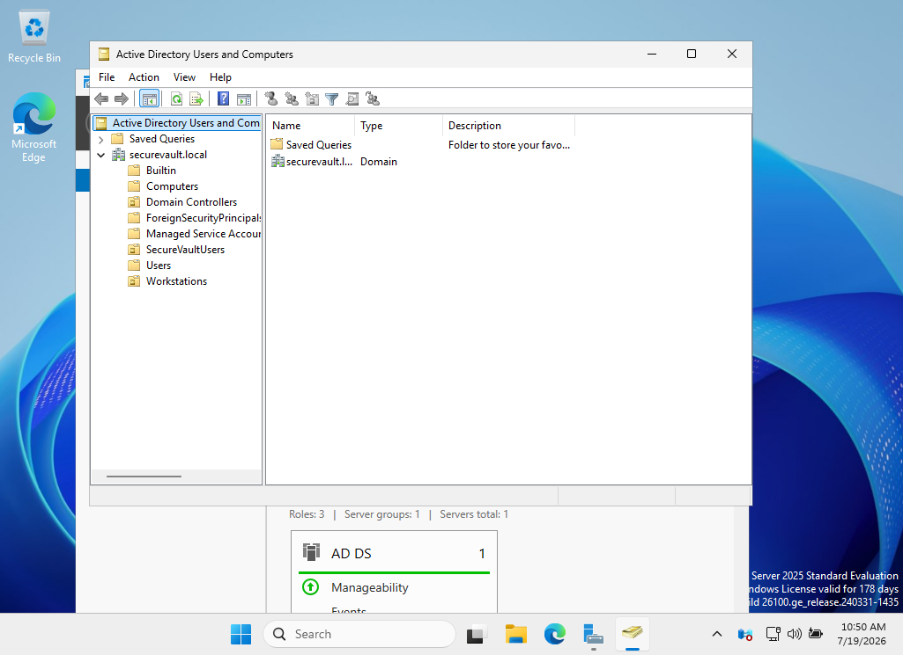
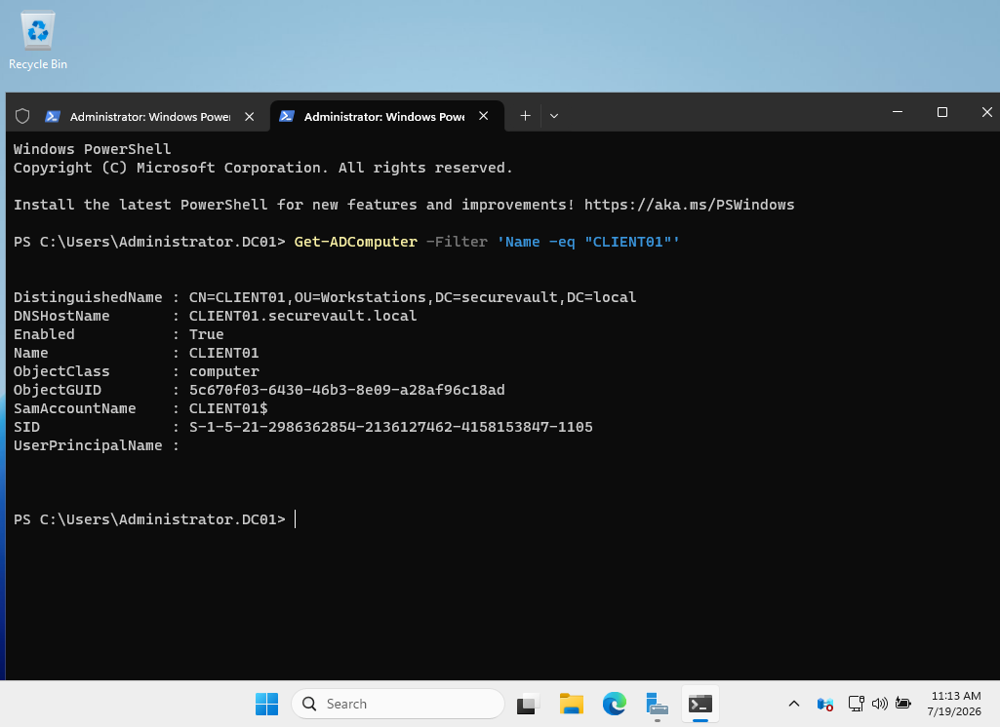
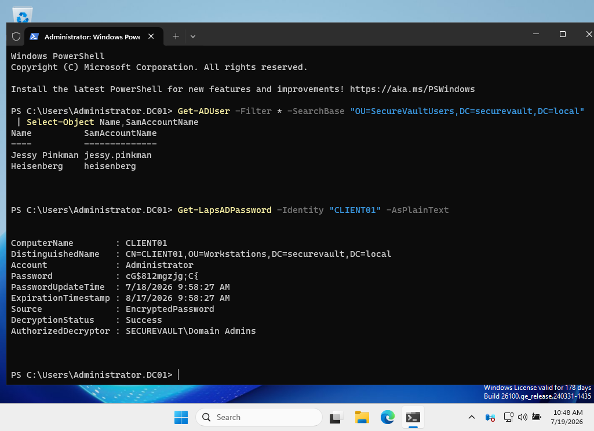
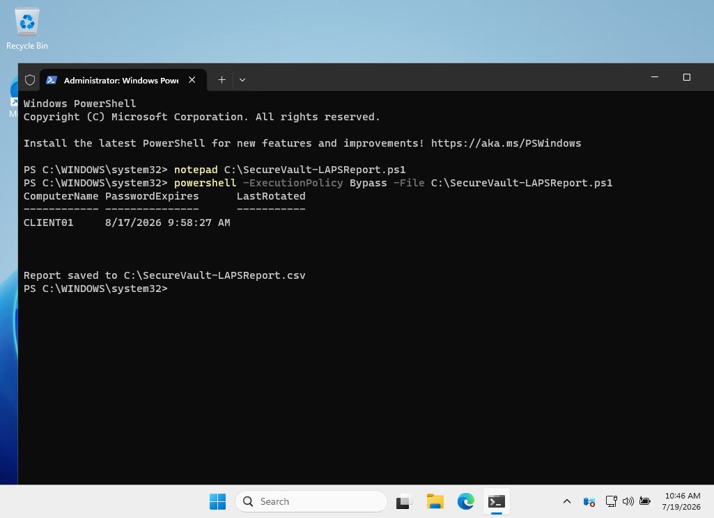
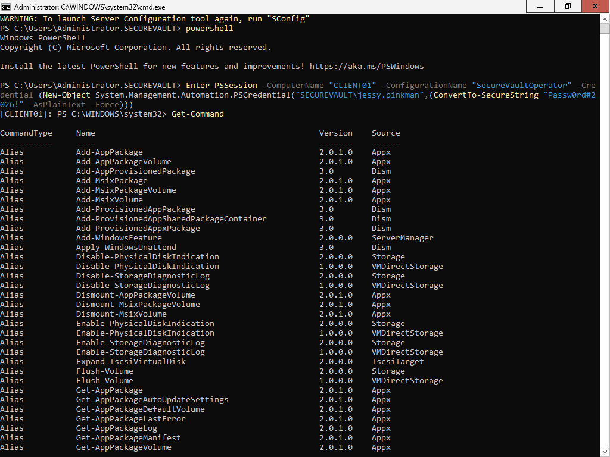
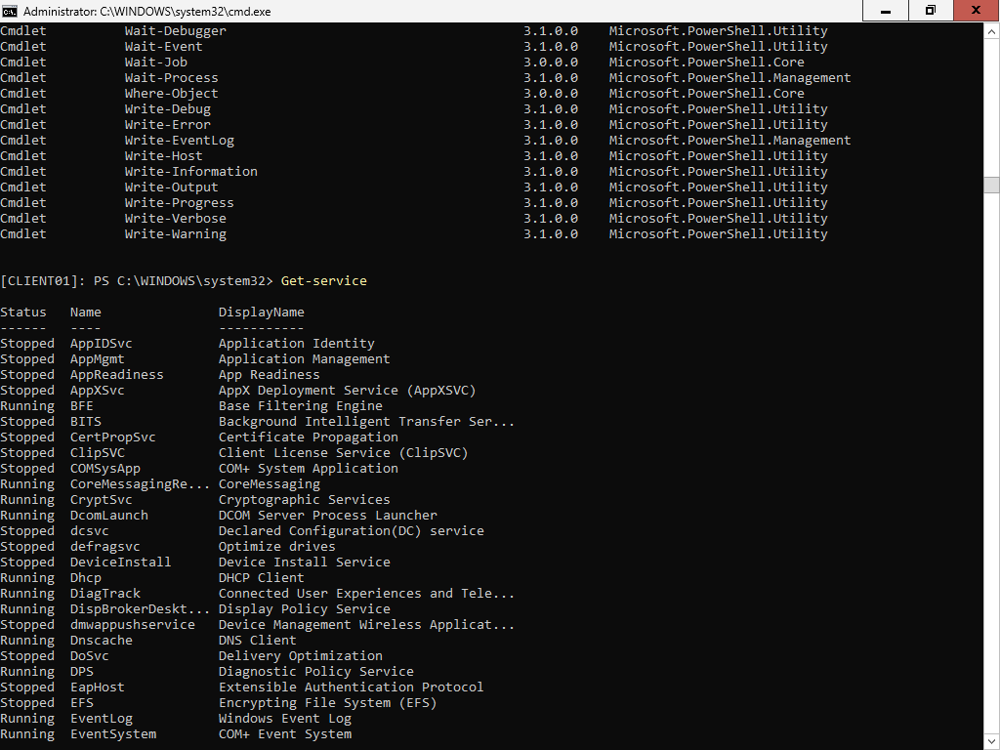
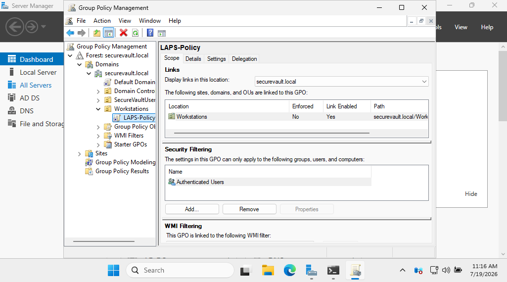
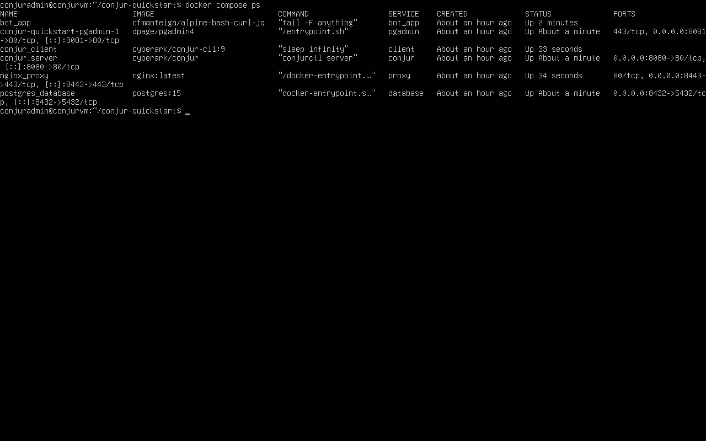
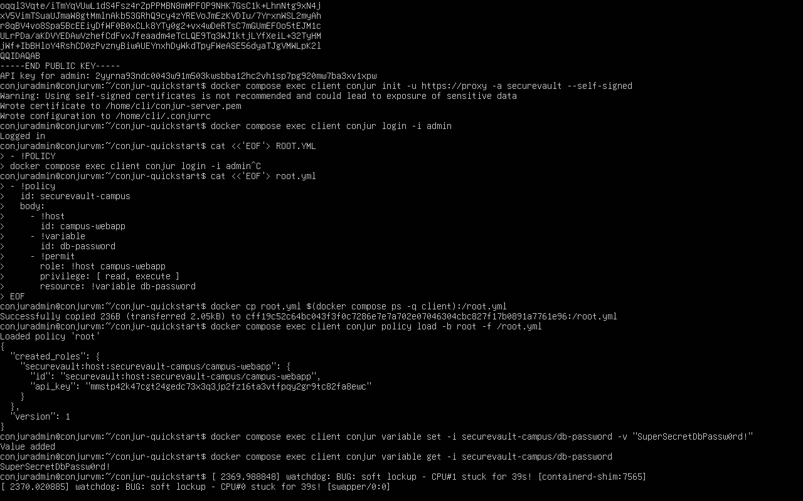
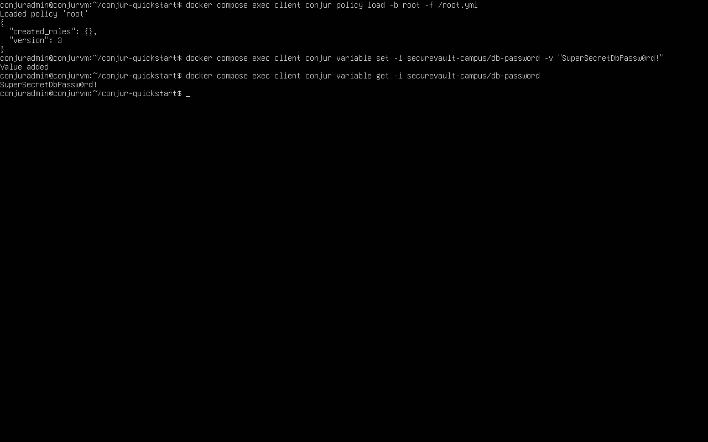

# 🔐 SecureVault Campus

> A Simulated Privileged Access Management (PAM) Lab using CyberArk Conjur Open Source, Windows Server Active Directory, Windows LAPS and PowerShell JEA.


---

# 📖 Overview

SecureVault Campus is a self-built Privileged Access Management (PAM) lab designed to demonstrate the core concepts behind CyberArk PAM using freely available technologies.

The project simulates enterprise privileged access management by combining:

- Windows Server 2025 Active Directory
- Windows LAPS
- PowerShell JEA
- CyberArk Conjur Open Source
- Docker
- Oracle VirtualBox

---

# 🏗 Architecture

DC01
- Active Directory
- DNS
- Group Policy

↓

CLIENT01

- Domain Joined Server
- Windows LAPS
- JEA Restricted Endpoint

↓

CONJURVM

- Ubuntu Server
- Docker
- CyberArk Conjur Open Source

---

# 🚀 Features

✅ Active Directory Domain

✅ Organizational Units

✅ Domain Users

✅ Domain Joined Server

✅ Windows LAPS

✅ Password Rotation

✅ Just Enough Administration (JEA)

✅ CyberArk Conjur Open Source

✅ Secret Management

✅ Docker Deployment

✅ PowerShell Automation

---

# 🛠 Technologies

- Windows Server 2025
- Ubuntu Server 24.04
- Active Directory
- Group Policy
- Windows LAPS
- PowerShell
- Docker
- Docker Compose
- CyberArk Conjur OSS
- Oracle VirtualBox

---

# 📂 Project Structure

```text
SecureVault-Campus
│
├── docs
├── docker
├── diagrams
├── screenshots
├── scripts
└── README.md
```

---

## 📸 Project Screenshots

### Active Directory Structure


### Domain Joined Client Verification


### Windows LAPS Password Retrieval


### LAPS Password Report


### PowerShell JEA Restricted Session


### Available Commands in JEA


### LAPS Group Policy


### CyberArk Conjur Docker Services


### Conjur Policy & Secret Retrieval


### Conjur Secret Management


# 🎯 Learning Outcomes

This project demonstrates practical knowledge of:

- Identity Management
- Privileged Access Management
- Least Privilege
- Secret Management
- Windows Administration
- Linux Administration
- Docker
- PowerShell Automation

---

# 👨‍💻 Author

**Shyam Kumar D**

LinkedIn

https://linkedin.com/in/shyam-kumar-d

GitHub

https://github.com/ShyamD2

---

⭐ If you like this project, consider giving it a Star!